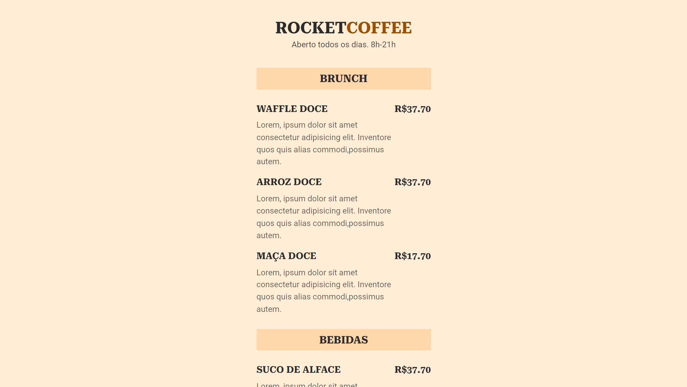

# Maratona Explorer 3.0

>Curso Maratona Explorer

Projeto construído na maratona Explorer da Rocketseat.

[ 🔗 Clique aqui para acessar](https://ricardojcosta.github.io/maratona3.0/)

## ⚒ Tecnologias

  - HTML (html semântico)
  - CSS 
  - Git e Github

## ✉ Contato

ricardoredes2006@gmail.com